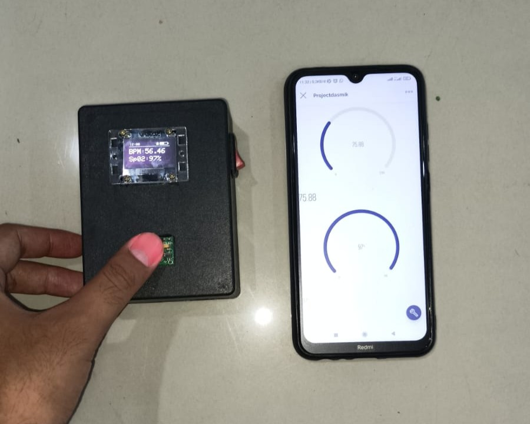
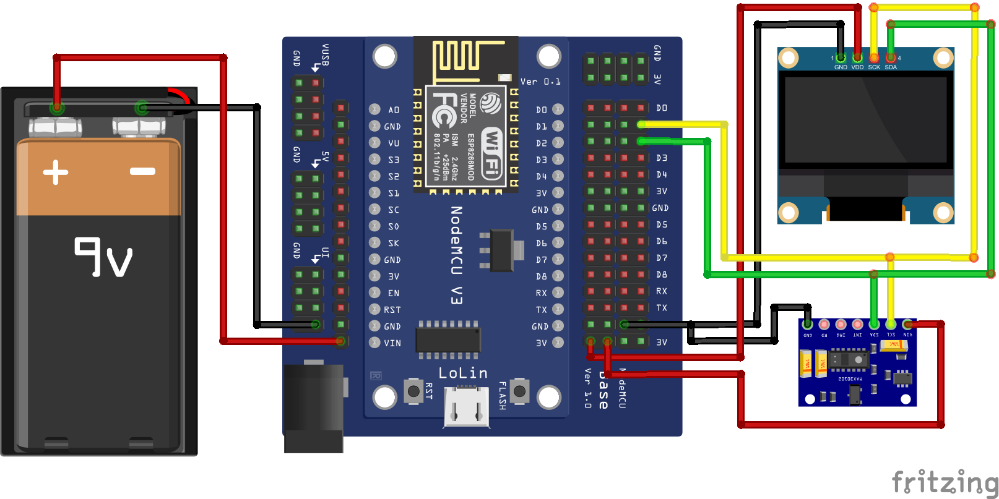
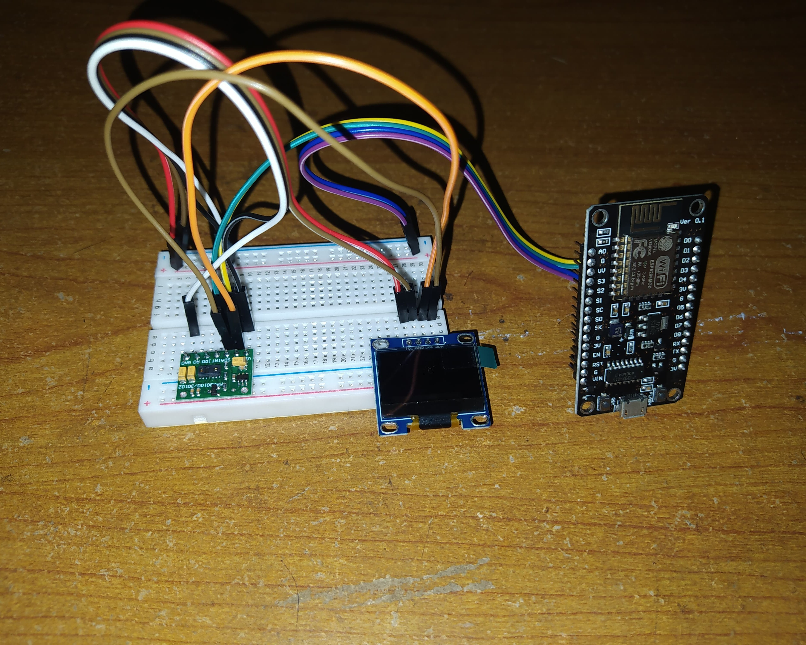
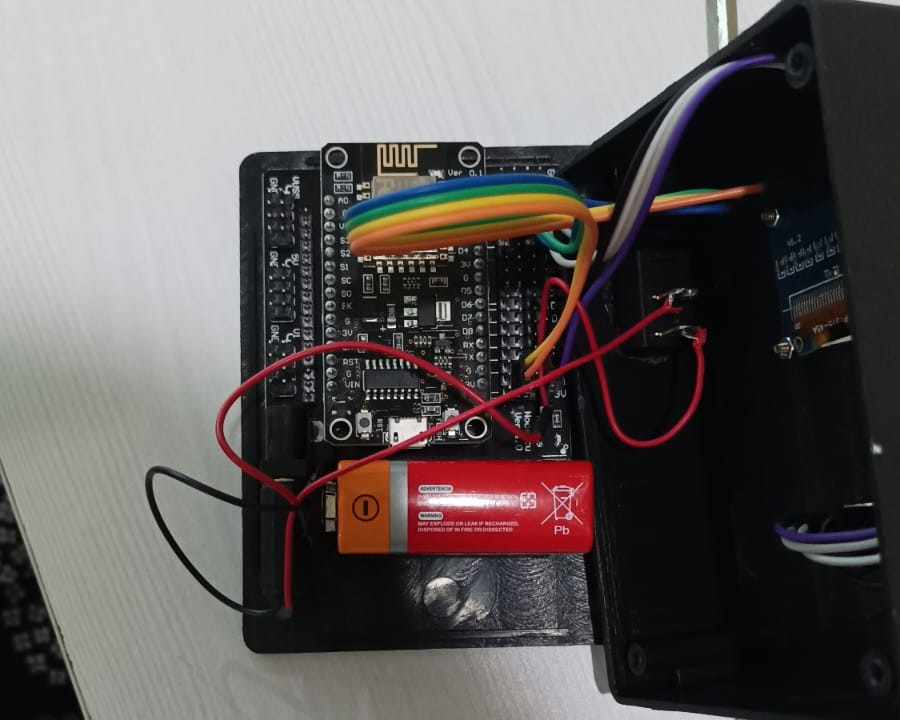

# ❤️ IoT Health Monitoring System 🩺

## 📋 Project Overview
This Health Monitoring System is an IoT-based solution designed to monitor vital health parameters in real-time. Developed as a final project for a Basic Microprocessor course, this system uses the ESP8266 microcontroller coupled with the MAX30100 sensor to measure heart rate and blood oxygen saturation levels (SpO2) non-invasively. The system features dual real-time display capabilities, showing vital signs on both an integrated OLED screen and the Blynk mobile application simultaneously.

Traditional health monitoring often requires expensive medical equipment or frequent visits to healthcare facilities. This project addresses these challenges by creating an affordable, portable, and user-friendly solution that allows individuals to monitor their vital signs. The on-device OLED display provides immediate feedback without requiring a smartphone, while the real-time data transmission to the Blynk application enables remote monitoring and access to health metrics, potentially aiding in early detection of health issues and continuous monitoring for those with existing conditions.

## ✨ Key Features
- **Real-time Vital Sign Monitoring**: Continuous tracking of heart rate and SpO2 levels
- **Dual Display System**: Data visualization on both OLED display and Blynk app simultaneously
- **Wireless Connectivity**: ESP8266 Wi-Fi capabilities for seamless data transmission
- **Mobile Application Interface**: Blynk app integration for remote monitoring
- **On-device Display**: OLED screen for immediate local feedback
- **Compact Design**: Portable and easy-to-use hardware configuration
- **Non-invasive Measurement**: Finger-based sensing using MAX30100 sensor
- **Low Power Consumption**: Efficient power management for extended use
- **Easy Setup**: Simple configuration process for the hardware and application

## 🖼️ Preview

### System Results

### Hardware Wiring Diagram

### Complete Prototype

### Assembly Process

## 🛠️ Technologies

### Hardware 🔌
- **ESP8266**: Wi-Fi enabled microcontroller for processing and transmitting data
- **MAX30100**: Integrated pulse oximetry and heart-rate monitor sensor
- **OLED Display**: Small screen for on-device data visualization
- **Power Management Components**: Regulators and batteries for portable operation
- **Connecting Wires**: For circuit assembly

### Software 💻
- **Arduino IDE**: For programming the ESP8266 microcontroller
- **Blynk IoT Platform**: For receiving, storing, and visualizing the sensor data
- **ESP8266 Libraries**: For Wi-Fi connectivity and system functions
- **MAX30100 Libraries**: For interfacing with the pulse oximeter sensor
- **Adafruit SSD1306 Library**: For controlling the OLED display
- **Adafruit GFX Library**: For graphics rendering on the OLED display

### Communication Protocols 📡
- **Wi-Fi**: For wireless data transmission
- **HTTP/HTTPS**: For API communication with Blynk servers
- **I2C**: For communication between the ESP8266 and MAX30100 sensor

## 🔄 How It Works

1. Power on the device
2. Wait for the Wi-Fi connection to establish (indicated on the OLED display)
3. Place your finger gently on the MAX30100 sensor
4. View immediate readings on the OLED display
5. Open the Blynk application on your smartphone for remote monitoring
6. Monitor your heart rate and SpO2 readings on both displays in real-time
7. Keep your finger steady for accurate measurements

## 📊 System Architecture

The Health Monitoring System is structured into three main components:

1. **Sensing Layer**: 
   - MAX30100 sensor for data acquisition
   - Physical interface for finger placement
   - LED indicators for operational status

2. **Processing & Display Layer**:
   - ESP8266 microcontroller for data processing
   - OLED display for immediate local data visualization
   - Firmware for sensor communication and display control
   - Wi-Fi module for network connectivity

3. **Application Layer**:
   - Blynk cloud server for data storage
   - Blynk mobile application for remote user interface
   - Visualization widgets for displaying health metrics

## 🚀 Future Improvements
- **Data Logging**: Implementation of long-term data storage for trend analysis
- **Alert System**: Automatic notifications for abnormal vital sign readings
- **Additional Sensors**: Integration of body temperature and blood pressure monitoring
- **Battery Optimization**: Enhanced power management for longer operation
- **Custom Mobile Application**: Development of a dedicated app beyond Blynk
- **Machine Learning Integration**: Pattern recognition for predictive health insights
- **Multi-user Support**: Profiles for different family members
- **Medical Professional Access**: Secure sharing of data with healthcare providers
- **Compact Redesign**: Miniaturization for wearable form factor
- **Cloud Integration**: Extended data analysis through cloud computing services
